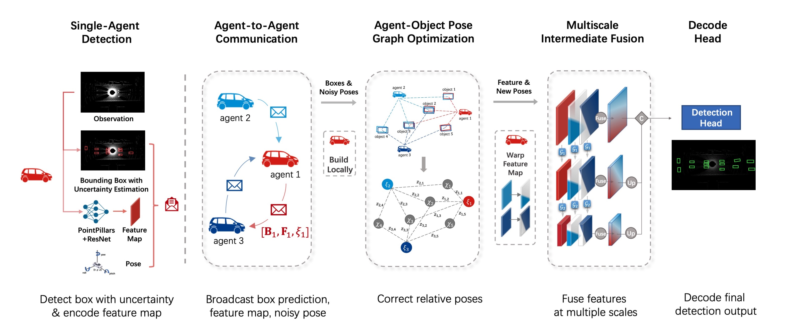

# CoAlign (ICRA2023)

Robust Collaborative 3D Object Detection in Presence of Pose Errors 

[Paper](https://arxiv.org/abs/2211.07214) | [Video](https://www.youtube.com/watch?v=zCjpFkeC2rA) ｜ [Readme Chinese Ver.](https://udtkdfu8mk.feishu.cn/docx/LlMpdu3pNoCS94xxhjMcOWIynie) ｜ [Readme English Ver.](https://udtkdfu8mk.feishu.cn/docx/SZNVd0S7UoD6mVxUM6Wc8If6ncc)




## Update🌟 2023.7.11

**Camera-based collaborative perception support!**

We release the multi-agent camera-based detection code, based on [Lift-Splat-Shoot](https://github.com/nv-tlabs/lift-splat-shoot). Support OPV2V, V2XSet and DAIR-V2X-C dataset. 

LiDAR's feature map fusion method can seamlessly adapt to camera BEV feature. Support CoAlign's multiscale fusion, V2XViT, V2VNet, Self-Att, FCooper, DiscoNet(w.o. KD). Please feel free to browse our repo. Example yamls are listed in this folder: `CoAlign/opencood/hypes_yaml/opv2v/camera_no_noise` 

## New features (Compared with OpenCOOD):
- Modality Support
  - [x] LiDAR
  - [x] Camera 🌟
- Dataset Support
  - [x] OPV2V
  - [x] V2X-Sim 2.0 🌟
  - [x] DAIR-V2X 🌟
  - [x] V2XSet

- SOTA collaborative perception method support
    - [x] [Attentive Fusion [ICRA2022]](https://arxiv.org/abs/2109.07644)
    - [x] [Cooper [ICDCS]](https://arxiv.org/abs/1905.05265)
    - [x] [F-Cooper [SEC2019]](https://arxiv.org/abs/1909.06459)
    - [x] [V2VNet [ECCV2022]](https://arxiv.org/abs/2008.07519)
    - [x] [FPV-RCNN [RAL2022]](https://arxiv.org/pdf/2109.11615.pdf)
    - [x] [DiscoNet [NeurIPS2021]](https://arxiv.org/abs/2111.00643)
    - [x] [V2X-ViT [ECCV2022]](https://github.com/DerrickXuNu/v2x-vit) 
    - [x] [MASH [IROS 2021]](https://arxiv.org/abs/2107.00771)
    - [x] [V2VNet(robust) [CoRL2020]](https://arxiv.org/abs/2011.05289)
    - [x] [CoAlign [ICRA2023]](https://arxiv.org/abs/2211.07214)

- Visualization support
  - [x] BEV visualization
  - [x] 3D visualization 🌟

- 1-round/2-round communication support
  - transform point cloud first (2-round communication)
  - warp feature map (1-round communication, by default in this repo. 🌟) 

- Pose error simulation support

## Installation

Please visit the feishu docs CoAlign Installation Guide [Chinese Ver.](https://udtkdfu8mk.feishu.cn/docx/LlMpdu3pNoCS94xxhjMcOWIynie) or [English Ver.](https://udtkdfu8mk.feishu.cn/docx/SZNVd0S7UoD6mVxUM6Wc8If6ncc) to learn how to install and run this repo. 

Or you can refer to [OpenCOOD data introduction](https://opencood.readthedocs.io/en/latest/md_files/data_intro.html)
and [OpenCOOD installation](https://opencood.readthedocs.io/en/latest/md_files/installation.html) guide to prepare
data and install CoAlign. The installation is totally the same as OpenCOOD, except some dependent packages required by CoAlign.


## Complemented Annotations for DAIR-V2X-C 🌟
Originally DAIR-V2X only annotates 3D boxes within the range of camera's view in vehicle-side. We supplement the missing 3D box annotations to enable the 360 degree detection. With fully complemented vehicle-side labels, we regenerate the cooperative labels for users, which follow the original cooperative label format.

Original Annotations | Complemented Annotations 
---|---
 | 
 | 
 | 


**Download:** [Google Drive](https://drive.google.com/file/d/13g3APNeHBVjPcF-nTuUoNOSGyTzdfnUK/view?usp=sharing)

**Website:** [Website](https://siheng-chen.github.io/dataset/dair-v2x-c-complemented/)

## Citation
```
@inproceedings{lu2023robust,
  title={Robust collaborative 3d object detection in presence of pose errors},
  author={Lu, Yifan and Li, Quanhao and Liu, Baoan and Dianati, Mehrdad and Feng, Chen and Chen, Siheng and Wang, Yanfeng},
  booktitle={2023 IEEE International Conference on Robotics and Automation (ICRA)},
  pages={4812--4818},
  year={2023},
  organization={IEEE}
}
```

## Acknowlege

This project is impossible without the code of [OpenCOOD](https://github.com/DerrickXuNu/OpenCOOD), [g2opy](https://github.com/uoip/g2opy) and [d3d](https://github.com/cmpute/d3d)!

Thanks again to [@DerrickXuNu](https://github.com/DerrickXuNu)
 for the great code framework.

## Q&A
1. Different AP results between arxiv v2 and arxiv v3? and different from OPV2V[ICRA 22']?

   See [Issue 4](https://github.com/yifanlu0227/CoAlign/issues/4).
   
2. How to get V2X-Sim-2.0 pickle file?

   See [Issue 2](https://github.com/yifanlu0227/CoAlign/issues/2).
