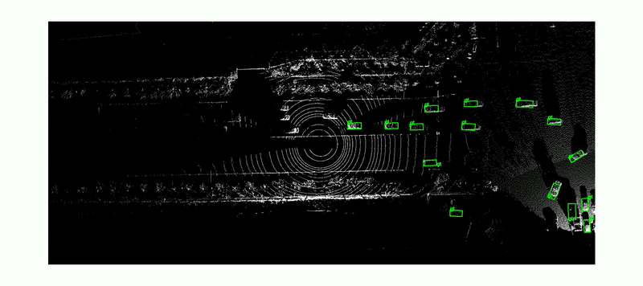

# CoAlign
CoAlign: Robust Collaborative 3D Object Detection in Presence of Pose Errors  

Paper: [Arxiv](https://arxiv.org/abs/2211.07214)

### Complemented Annotations for DAIR-V2X-C
Originally DAIR-V2X only annotates 3D boxes within the range of camera's view in vehicle-side. We supplement the missing 3D box annotations to enable the 360 degree detection. With fully complemented vehicle-side labels, we regenerate the cooperative labels for users, which follow the original cooperative label format.

Original Annotations | Complemented Annotations 
---|---
 | 
 | 
 | 


**Download:** [Google Drive](https://drive.google.com/file/d/13g3APNeHBVjPcF-nTuUoNOSGyTzdfnUK/view?usp=sharing)

**Website:** [Website](https://siheng-chen.github.io/dataset/dair-v2x-c-complemented/)

### Citation
```
@article{lu2022robust,
  title={Robust Collaborative 3D Object Detection in Presence of Pose Errors},
  author={Lu, Yifan and Li, Quanhao and Liu, Baoan and Dianati, Mehrdad and Feng, Chen and Chen, Siheng and Wang, Yanfeng},
  journal={arXiv preprint arXiv:2211.07214},
  year={2022}
}
```
